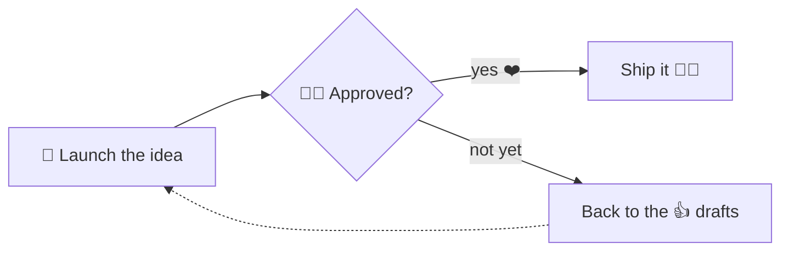

# Emoji in a diagram

Labels with emoji, drawn and measured in the test fonts (`fixtures/fonts`), added as fallbacks
as a scan of the system's fonts adds them:

```mermaid
flowchart LR
    idea["🚀 Launch the idea"] --> vote{"👍🏽 Approved?"}
    vote -->|yes ❤️| ship["Ship it 🚀🚀"]
    vote -->|not yet| back["Back to the 👍 drafts"]
    back -.-> idea
```
